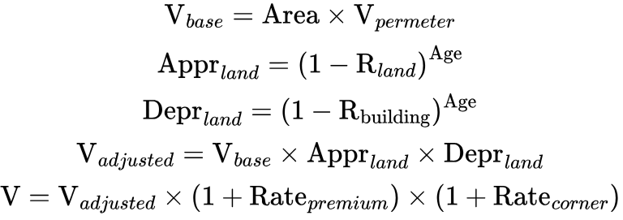

# Thrive Property Calculator


## `🚀 How to use`

1. Run `make build` to compile the program. It will result in binary file `bin/thrivepropcalc`.
2. Prepare the inputs in `input.txt`
3. Run `make run` to run the binary file. You should provide an `input.txt`, otherwise the program won't run as intended.
4. Run `make clean` to clean up the compiled file.
5. Alternatively, you can build and run the program with a single command `make all`.


## `❓ How does it work?`

First, we need to understand the rules.

1. Base property value is calculated per square meter:
   - Standard location: Rp 10,000,000/m^2
   - Premium location: Rp 15,000,000/m^2

2. Annual value adjustments:
   - Land appreciates 5% annually
   - Residential buildings depreciate 2.5% annually
   - Commercial buildings depreciate 3.5% annually

3. Location bonuses:
   - Premium location adds 20% to total value
   - Corner lot adds 15% to total value

5. Monthly maintenance calculation:
   - Residential base fee: Rp 2,500/m²
   - Commercial base fee: Rp 3,500/m²
   - Security fee: Rp 1,000/m²
   - Cleaning fee: Rp 800/m²

These are the formulas that will be used to calculate the property value.



- `V` is the property's value.
- `Appr_land` and `R_land` are the land appreciation factor and rate, respectively.
- `Depr_land` and `R_building` are the building depreciation factor and rate, respectively.
- `Rate_premium` and `Rate_corner` (it should be `R_premium` and `R_corner`, i made a mistake lmao) are the rates of premium bonus and corner bonus, respectively.

### `📥 Input`

```
2024-01-15T10:00:00 RESIDENTIAL 150.5 2020 PREMIUM YES 2 POOL,GYM
2024-01-15T10:01:00 COMMERCIAL 200.0 2018 STANDARD NO 3 PARKING
2024-01-15T10:02:00 RESIDENTIAL 180.0 2022 PREMIUM CORNER 1 POOL
```

- Each line contains: timestamp type area_m2 build_year location corner parking facilities
- Timestamp format: YYYY-MM-DDThh:mm:ss
- Type: RESIDENTIAL or COMMERCIAL
- Area: float with 1 decimal (Max: 1000.0)
- Build year: YYYY format (1900-2024)
- Location: PREMIUM or STANDARD
- Corner: YES/NO/CORNER
- Parking: integer (0-99)
- Facilities: comma-separated list (POOL,GYM,PARKING)

Error occurs under the following conditions:
- Input not following format: YYYY-MM-DDThh:mm:ss TYPE area_m2 year LOCATION CORNER parking FACILITIES
- Blank line
- Non-sequential timestamps
- Gap between records exceeds 5 minutes
- Less than 2 lines of data
- Invalid property type
- Area less than or equal to 0
- Build year before 1900 or future year
- Invalid location type
- Invalid corner specification
- Negative parking units
- Invalid or duplicate facilities

### `📤 Output`
Program will display total property value and monthly maintenance, then all property records ordered by value per square meter from highest to lowest.
```
Property Value: Rp 2,500,000,000
Monthly Maintenance: Rp 1,750,000
2024-01-15T10:00:00 RESIDENTIAL 150.5 2020 PREMIUM YES 16,610,631/m²
2024-01-15T10:02:00 RESIDENTIAL 180.0 2022 PREMIUM CORNER 15,850,000/m²
2024-01-15T10:01:00 COMMERCIAL 200.0 2018 STANDARD NO 12,750,000/m²
```
